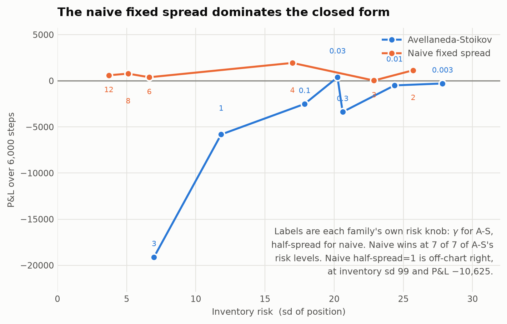
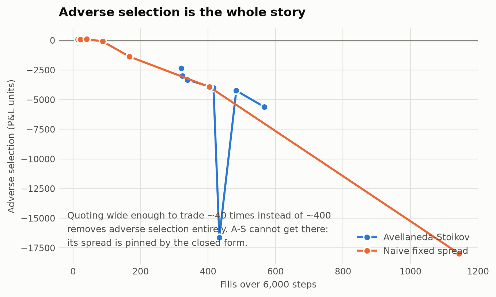
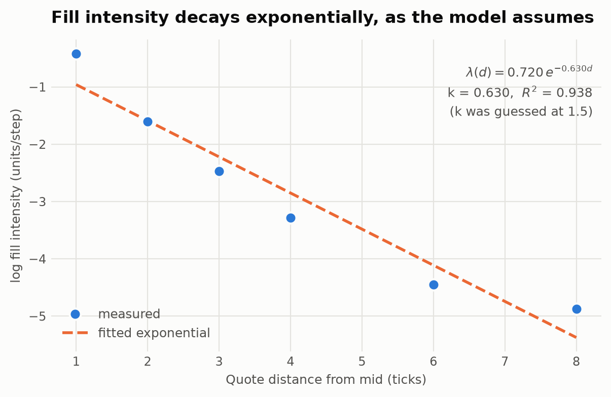

# Limit Order Book & Market Making

A price-time-priority matching engine, a synthetic market with informed traders in
it, and two market makers — one naive, one the Avellaneda–Stoikov closed form —
compared on a risk/return frontier rather than head-to-head.

---

## The finding

**The naive fixed spread dominates Avellaneda–Stoikov at 7 of 7 of A-S's risk
levels.**



That is not a bug in the implementation. γ does exactly what the model says it
should — inventory standard deviation falls from **63.6 to 7.1** as risk aversion
rises, monotonically, with a correct flat region below γ≈0.01 where the skew is
too small to bite. The closed form is implemented and it works.

It loses anyway, and the P&L decomposition says why in one line: **adverse
selection.**



Quoting at half-spread 6–12, the naive maker trades ~40 times instead of ~400 and
its adverse selection turns **positive** (+112, +79, +99) — it is never picked
off, because it is never at the touch when an informed trader arrives. A-S cannot
go there: its spread is pinned by the closed form at ~3.2 ticks, and the inventory
skew keeps dragging it back toward the mid.

**Avellaneda–Stoikov's derivation contains no informed traders.** Arrival
intensity depends on distance from the mid and nothing else; there is no
information asymmetry anywhere in the model. So this is not a refutation of the
paper — it is a demonstration that a spread optimised for inventory risk is not
robust to a cost the optimisation never priced. In a market with 35% informed
flow, the winning move is to barely quote, and no amount of tuning γ gets you
there.

## Calibrating k, which most implementations guess

The A-S spread carries a term `(2/γ)·ln(1 + γ/k)`, where `k` is the decay rate of
fill intensity in distance from the mid. The model *assumes* `λ(δ) = A·e^(−kδ)`.
That is measurable here, so it is measured.



```
fitted  λ(d) = 0.720 · exp(-0.630 · d)
k = 0.630     R² = 0.938     (guessed at 1.5)
```

Two things fall out. The exponential-arrival assumption **holds** on this flow
(R²=0.938), so the closed form is being applied inside its own model. And the
guess was wrong by 2.4×, which had put the A-S spread at less than half its
calibrated width — the earlier "A-S loses" runs were partly measuring a bad
constant, which is why the frontier was worth building.

## The decomposition, which is the point of the project

Most public LOB projects plot a P&L curve and stop. That number cannot distinguish
a maker that got paid for liquidity from one that got lucky on a drifting
position. This splits it into three terms that sum **exactly** to the total:

```
total = Σ sᵢ(mᵢ − pᵢ)      spread capture      paid to provide liquidity
      + Σ sᵢ(vᵢ − mᵢ)      adverse selection   cost of being there when
                                               someone informed arrived
      + Σ sᵢ(V  − vᵢ)      inventory           mark-to-market on what you carried
```

It telescopes, so the identity is testable rather than asserted — and two tests do
exactly that.

It earned its place on the first run:

```
naive, half-spread 2      total +2,549
  spread capture          +1,650
  adverse selection       −3,974
  inventory               +4,872
```

A P&L curve calls that a profitable market maker. **It was not paid for
liquidity — it got lucky on a drifting position.**

The measurement horizon is a choice and is shown rather than hidden: across
h=10…160 the total stays fixed at 2,549 while the adverse/inventory boundary moves
from −4,580/+5,479 to −2,490/+3,388.

## What this does not prove

**The order flow and both agents were written by the same person.** Any P&L here
is a property of those assumptions, not evidence of an edge in any real market.
The simulator is not calibrated to any instrument — arrival rates, the depth
profile and the informed fraction were chosen to produce a book that behaves
plausibly.

What it legitimately shows is the *shape* of the tradeoff, and where a result
comes from.

## Five modules, five bugs found by mutation testing

Every module here had a defect that the test suite passed cleanly over until a
mutant exposed it. None was found by reading the code.

1. **`book.py` — a self-match guard on the wrong entity.** It compared *order
   ids*, which is dead code: a taker gets a fresh id and matches before it rests.
   The real case is participant-level. *Then the first fix was also wrong* — pure
   skip policy left the book **crossed**, so it is now skip-then-cancel-newest, as
   CME does.
2. **`flow.py` — an owner collision silenced all uninformed flow.** Noise makers
   and uninformed takers shared an owner id, so self-trade prevention refused
   **every** uninformed market order — 0 fills over 6,000 steps, while every other
   statistic looked healthy.
3. **`agent.py` — two volatility estimators that silently disabled inventory
   control.** Sample standard deviation *overflowed a float* (squaring a 120-tick
   liquidity gap is not measuring volatility). Then MAD, the textbook robust fix,
   was **degenerate**: the mid is unchanged 2 steps in 3, so median=0, MAD=0, and
   σ pinned to its floor on 49 of 49 samples. Winsorised now.
4. **`evaluate.py` — adverse selection measured against the wrong series.**
   Swapping the latent value for the observed mid survived every test, because the
   identity telescopes either way. Against the mid you measure "did the market move
   against me"; against the latent value, "was my counterparty informed".
5. **`frontier.py` — caught clean**, 6/6 mutants, including three on the dominance
   rule the headline conclusion rests on.

And the market itself was degenerate before it worked: noise makers posted purely
around the observed mid, so **no participant had any opinion about value**. It ran
away past 200 ticks in all eight depth/churn configurations tried. Makers now hold
a *noisy view* of value — the standard noisy-rational-expectations setup.

## Layout

```
book.py            price-time priority engine; integer ticks, lazy heap deletion
flow.py            informed + uninformed order flow, noisy-view makers
agent.py           NaiveMM and AvellanedaStoikov; the agent never sees fair value
evaluate.py        the three-way P&L decomposition
frontier.py        k calibration + the risk/return sweep
bench_book.py      throughput
plot_frontier.py   the three figures
test_*.py          56 tests
```

**Engine throughput** (CPython 3.12, single core, 200k events): resting 528K/s,
crossing 441K/s, **mixed 236K/s** — 70% limit / 20% cancel / 10% market around a
drifting mid, the closest of the three to real flow.

## Running it

```bash
pip install pytest hypothesis matplotlib
python -m pytest -q          # 56 tests
python bench_book.py         # throughput
python evaluate.py           # the decomposition + horizon sensitivity
python frontier.py           # calibrate k, sweep both families  (~4 min)
python plot_frontier.py      # figures
```

## References

Avellaneda & Stoikov (2008), *High-frequency trading in a limit order book*,
Quantitative Finance 8(3).
